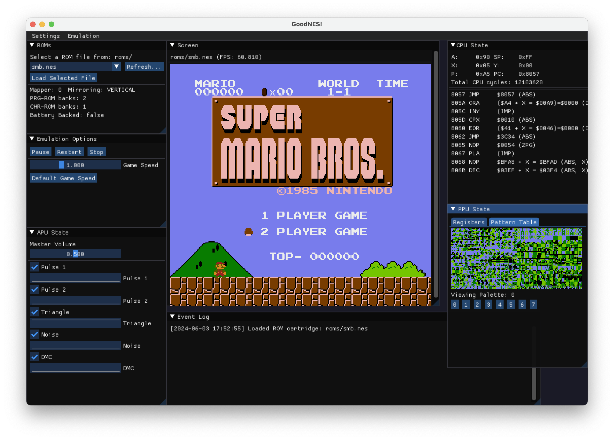
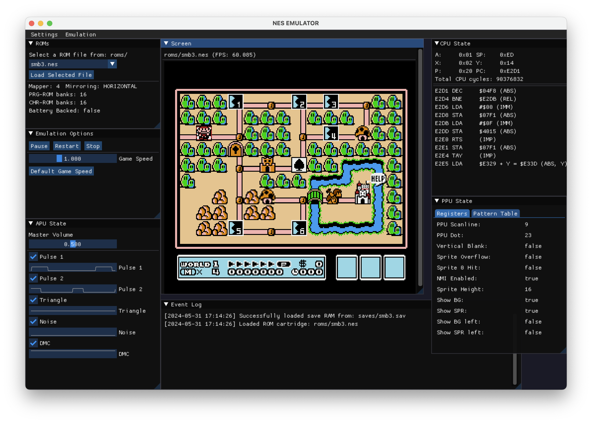
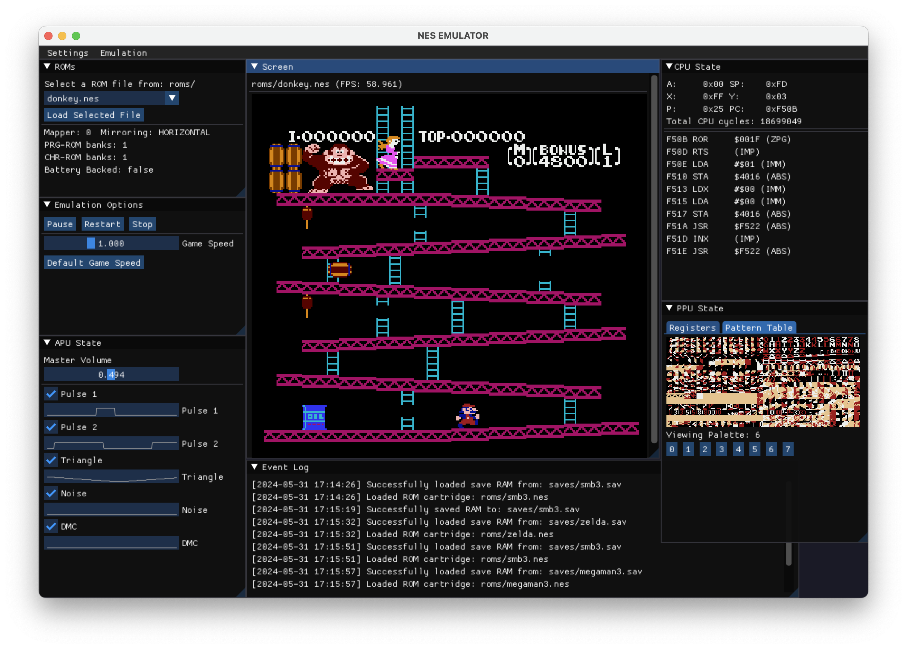
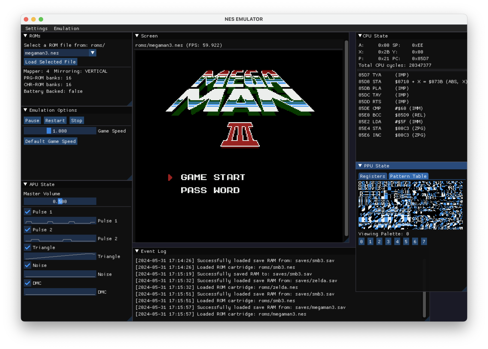
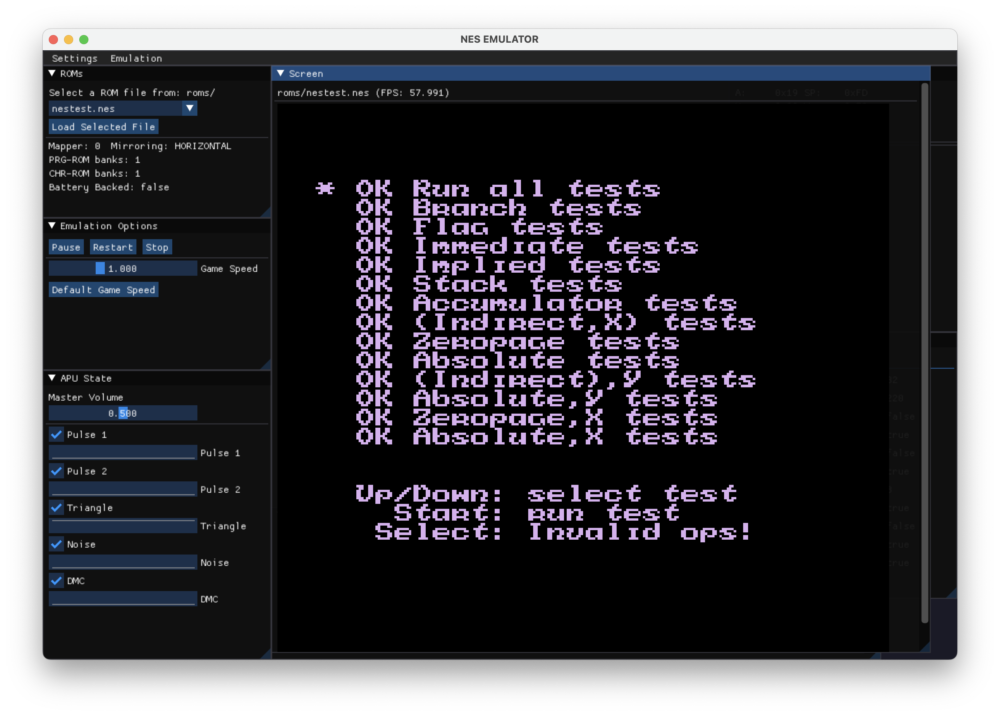
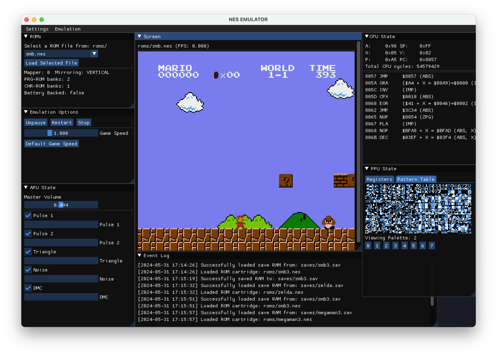

# NES Emulator + Rust + ImGui = :)



A NES emulator built using Rust which includes a debugging UI for desktop using ImGui. The GUI allows you to:
- Pause, stop, or restart the emulation, as well as adjust the game speed
- Enable/disable each audio channel
- See cartridge details 
- View the CPU, PPU, and APU state, which includes registers, pattern tables and code disassembly


## Desktop Application Setup 
Before starting, make sure you have [Rust](https://www.rust-lang.org/tools/install) installed and make sure the version is at least **1.79.0-nightly**. 

- Add ROMs to the `/roms` folder. Save data will be automatically placed in the `/saves` folder with the same name as its ROM file and a `.sav` extension.

- To run the application:
```
cargo run -p nes-emulator-desktop --release
```

## GUI Screenshots 







  




